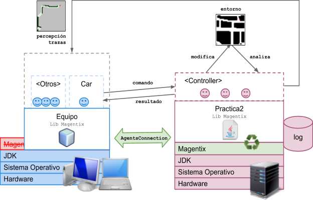
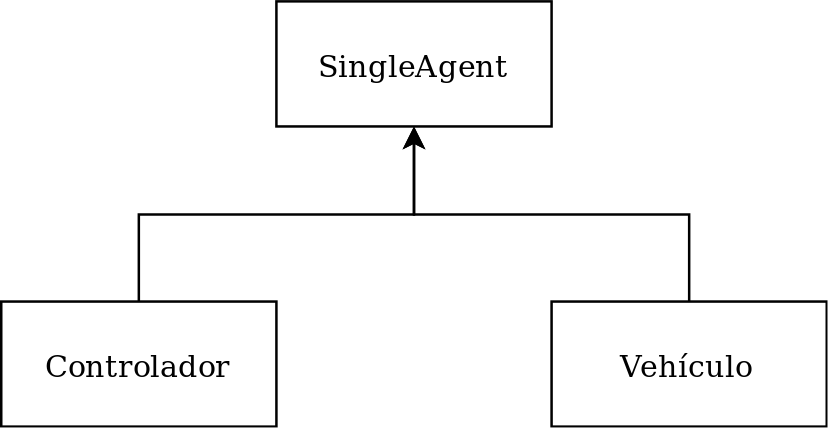
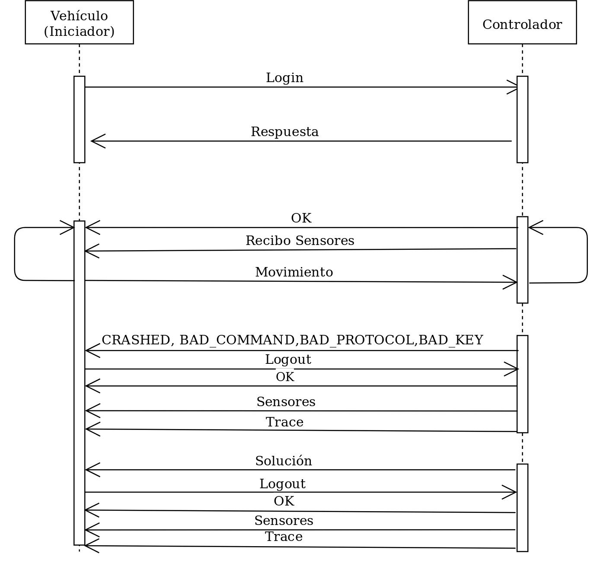
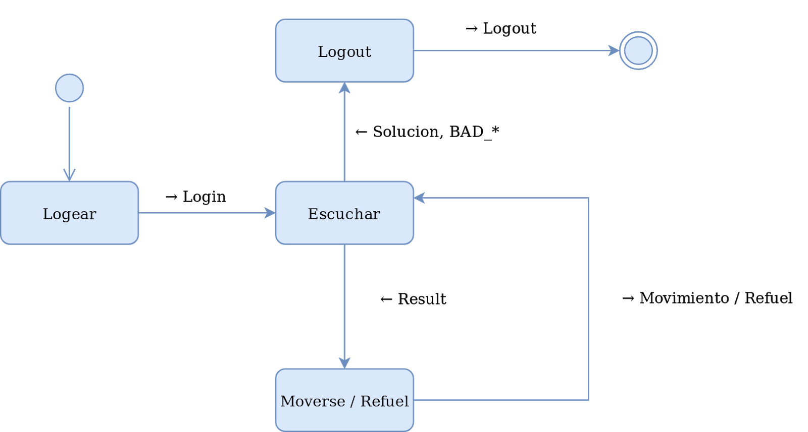
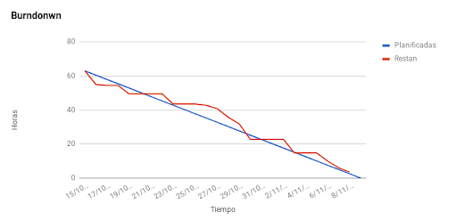
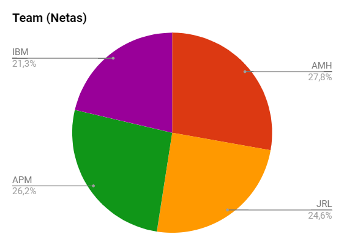
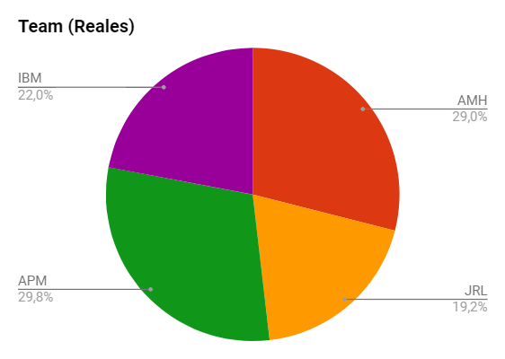
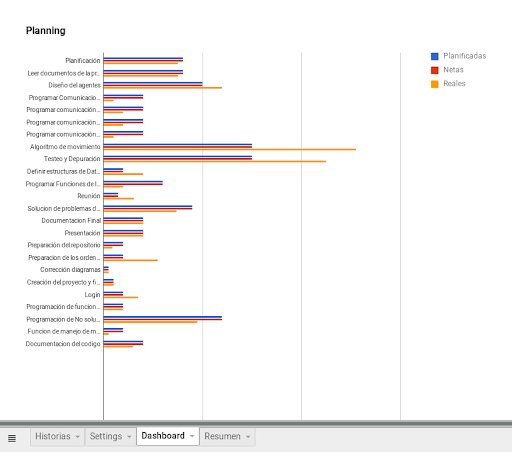
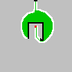
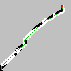

# Práctica 2

Esta práctica consiste en realizar una primera implementación de agentes simples en la que se va a poner especial énfasis en la capacidad de resolución de problemas y autonomía del agente. 

## Descripción de la práctica
El problema que se deberá resolver es el diseño e implementación de un vehículo autónomo que se desplaza por las calles de una ciudad. El vehículo que deberá llegar hasta un punto de destino situado en una de las calles, a partir de una señal que le indica al vehículo a la distancia a la que se encuentra el destino teniendo en cuenta que el vehículo podrá encontrar obstáculos en el camino que deberá bordear para no chocar con ellos.

## Arquitectura de la práctica
La arquitectura del desarrollo de la práctica estará distribuida entre múltiples plataformas tal y como se indica en la figura, estando la parte del servidor (en color rosa) ya desarrollada (controla el entorno del agente) y disponible para su uso y los alumnos deberán centrarse en construir los agentes externos (en color azul): al menos un vehículo y todos los agentes que puedan ser necesarios para guiarlos por el entorno los cuales podrán ejecutarse desde los laboratorios de prácticas o desde un ordenador portátil.

## Solución implementada

### Diagrama de clases

Sólo hay un agente que se encarga de recibir los sensores. Decidimos diseñarlo así para ahorrarnos la implementación de comunicación entre varios agentes.
### Diagrama de secuencia

El vehículo es el que inicia la comunicación, solo hace logout si recibe un CRASHED o BAD_* o si encuentra la solución. En los dos casos recibe todos los mensajes necesarios, el último es la traza que ha realizado el agente.

### Diagrama de estados

El agente se encuentra en un estado inicial desde que solo puede loguearse. Después pasa a escuchar los mensajes de controlador. Desde el estado escuchar puede moverse o rellenar la batería y volver a escuchar o puede ir al estado lougout por encontrar la solución o recibir un mensaje de error.

## Aspectos importantes del desarrollo

En cuanto al desarrollo de la práctica se llevó a cabo ajustándose al burndown planificado. Hubo un parón en mitad del desarrollo pero se suple rápidamente recuperando esas horas en los días venideros.

El reparto de las tareas de grupo se llevó a cabo equitativamente.La primera semana se diseñaron los modelos del agente. La Segunda semana programamos un sensor cada miembro del grupo y los probamos en el mapa uno. La siguiente semana corresponde al retraso respecto al burndown, esta semana estuvimos pensando el algoritmo de movimiento. La semana final implementamos el algoritmo de movimiento e hicimos las últimas funciones de manejo de mensajes y de detección de que no existe solución.

Sin embargo, como se aprecia en la gráfica superior, el algoritmo de movimiento y el testeo y depuración se llevaron más horas reales de las que teníamos planificadas. Esto nos puso en la obligación de pedirle al ProductOwner 9 horas netas extras. Estas horas fueron utilizadas para hacer el algoritmo de no solución y El manejo de mensajes de error. Además también aumentamos las horas asignadas al algoritmo de movimiento y depuración.

Se intentó llevar a cabo un algoritmo A* lo cual se llevó también bastantes horas, sin embargo decidimos pararlo pues las trazas que obteniamos de resultado ya cumplian las expectativas.

## Autonomía del agente
La primera acción del agente es mirar todas las casilla a las cuales se puede mover y no son obstáculo. Después comienza un filtrado quitando aquellas casillas que ya están en la memoria del agente, para evitar que este vuelva sobre sus propios pasos creando bucles.

El siguiente Paso que hace el agente mira de estas casillas cuál es la más prometedora usando el scanner y ese es el movimiento que envía el agente al servidor para moverse.

Si el agente no tiene ningún movimiento posible, este hace un movimiento aleatorio para conseguir alguna casilla posible más que no se llegara anteriormente.

La memoria del agente es un array de 1000 en la que se guarda las posiciones del gps por las que ha pasado el agente.
Para saber si hay solución, guardamos las posiciones del gps donde el agente ve el objetivo en un array. Junto con esta posición guardamos el número de veces que ha pasado por esta.Al situarse encima de alguna de las posiciones del array más de 6 veces el programa se desconectara al agente haciendo un logout.

El algoritmo es greedy por lo que da lugar a trazas como las siguientes.

En este mapa se puede ver que debido a la memoria necesita recorrer casi el círculo entero para resolverlo. Esto es debido a que no puede pisar las casillas de la memoria.

En el mapa 2 al ser un algoritmo Greedy que siempre va por el óptimo local se puede observar que aunque obtiene un resultado bastante bueno no es el camino más corto.

Aquí se puede observar como el Greedy obtiene el camino óptimo al no estar el objetivo detrás de obstáculos y recovecos.