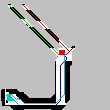

# Práctica 3

Esta práctica consiste en la implementación de un equipo de agentes heterogéneos, con capacidades diferentes, en la que se va a poner especial énfasis en la capacidad de auto-organización del equipo de agentes para distribuir sus objetivos y en su capacidad de gestionar recursos compartidos de forma que colaboren en un objetivo común.

## Descripción de la práctica
El problema que se deberá resolver es el diseño e implementación de un sistema multiagente, inspirado en la práctica anterior, que emula un problema de búsqueda distribuida en una ciudad. Los vehículos empleados deberán localizar un punto objetivo, cuya posición se desconoce, pero que se puede percibir con el mismo radar de la Práctica 2, en caso de estar suficientemente cerca. Hay que tener en cuenta que cada vehículo podrá encontrar obstáculos en el camino que deberá bordear para no chocar con ellos. Estos obstáculos pueden ser muros dentro del mapa, el borde del mapa o bien otros vehículos presentes en la misma posición. Igualmente los vehículos deberán organizarse para utilizar un recurso compartido vital: las recargas de la batería son limitadas y podrían llegar a agotarse antes de que todos los vehículos lleguen al objetivo.

## Arquitectura de la práctica
La arquitectura del desarrollo de la práctica estará distribuida entre múltiples plataformas tal y como se indica en la figura, estando la parte del servidor (en color morado) ya desarrollada (controla el entorno del agente) y disponible para su uso y los alumnos deberán centrarse en construir (al menos) los cuatro agentes externos (vehículos de búsqueda) los cuales podrán ejecutarse desde los laboratorios de prácticas o desde un ordenador portátil.

## Tipo de sociedad

Nuestra sociedad es un híbrido entre una sociedad Jerárquica y en Red.

En la fase de exploración los agentes reciben las órdenes de un agente controlador. Este agente controla la memoria compartida de los agentes y les genera los movimientos que deben realizar. Sin embargo, la orden final de movimiento es mandada por el agente vehículo directamente al servidor.

Más tarde, en la fase de llegar al objetivo, seleccionan ellos mismos los movimientos que deben hacer para llegar al objetivo pero siguen en comunicación con xavier para el control de recursos.

## Clases y sus usos

- **Profesor Xavier:** Se va a encargar de gestionar la memoria compartida y tomar decisiones colaborativas entre los X-Agents, cómo indicar cuándo se pueden mover o no, gestionar quien encuentra la solución y avisar a los demás.

- **X-Agents:** Son los vehículos. Están a expensas de la información y órdenes que les da Xavier. Cuando encuentran un objetivo se lo informan a Xavier y comienzan la heurística de llegada. En todo momento son ellos los que le comunican los movimientos al servidor.
 
- **Mapa:** Clase auxiliar que ayuda a Xavier. En ella se calculan los movimientos de exploración de los vehículos y se seleccionan los más prometedores.

## Comunicación y paso de mensajes

La comunicación de Xavier comienza haciendo un subscribe al mundo. Después él crea los agentes coches, ellos se suscriben a Xavier y él les manda el conversationID con el mundo. Seguidamente le dice a los vehículos que hagan el check in y se queda escuchando por las capabilities de los vehículos. Finalmente entra en un bucle en el que da turno de palabra a los coches, el les manda un request con información y tras moverse los coches recibe un request con nueva información.

El vehículo comienza escuchando y suscribiendose a Xavier cuando se le ordena. Después cuando Escucha el conversationID hace el check in y envía las capabilities a Xavier.Después entra en un bucle en el que Xavier le da la palabra a cada coche.
Aquí, dependiendo de si se ha visto el objetivo o no, el coche recibirá de xavier el movimiento o lo calculara el con la heurística de la práctica anterior.
En cada iteracion del bucle recibira de Xabier el turno de palabra junto con la información y le enviará al finalizar la nueva información, haciendo que xavier pase al siguiente coche.

## Algoritmo de exploración

El algoritmo de exploración se basa en la heurística “Pulgarcito”. “Pulgarcito”, cada vez que se ejecuta un movimiento por un vehículo, guarda las casillas que ve el agente en un map, junto con una puntuación. Esta puntuación aumenta cada vez que vuelve a pasar el radar por las casillas.La casilla objetivo da el valor -infinito.

Después, el agente ve en su radar todas las casillas a las que puede pasar y en las que puedes llegar al final del radar en esa dirección y se queda con la que menos puntuación tiene, que es la que más casillas nuevas descubrirá. La idea de que el vehículo vea si puede llegar hasta el final del radar sirve para evitar que los vehículos se peguen a las paredes malgastando energía del mundo.

Seguidamente vuelve a hacer esta comprobación pero solo con la parte del radar inmediata al vehículo. Esto evita que vehículos con un radar grande se queden encerrados entre paredes. Y finalmente se mira si la solución está en el radar, si es asi se va a ella directamente ignorando el resto de movimientos.

Todo esto va acompañado de una memoria que guarda los pasos de cada vehiculos, la cual pertenece a Xavier, para evitar que los vehículos entren en ciclos.

## Algoritmo de llegada

En la llegada los agentes usan una versión modificada de la heurística de la anterior práctica. El agente mira todas las casillas a su alrededor y se queda con las que no son obstáculos ni coches. Después para cada una de estas calcula la distancia con el objetivo y selecciona la mejor. Para evitar que el coche entre en ciclos este tiene una memoria en la que se van guardando los pasos para evitar que vuelva sobre sus propios pasos. Por último, cuando esta ve el objetivo olvida esta heurística y directamente va hacia él, evitando a otros coches en el proceso.

Los coches consiguen la información de los sensores antes de cada movimiento. En este algoritmo Xavier sigue en comunicación con los vehículos. recabando datos y dándoles el turno de palabra y gestionando su gasolina.

El control de recursos se encarga de que primero vayan al objetivo los pájaros y después los coches por cercanía. La parte de los voladores está implementada, sin embargo la parte de la cercanía no la tenemos.

## Algoritmo de múltiples objetivos

En el algoritmo de múltiples objetivos no ha dado tiempo a implementarlo. Sin embargo está diseñado.

El algoritmo comprueba en el radar los coches si hay algún objetivo mientras explora o va de camino a un objetivo y, si hay alguno, lo añade a un Map que contiene todos los objetivos vistos. Los agentes al aplicar la heurística, en vez de ver la distancia a un solo objetivo, comprueban la distancia a todos los objetivos.

También se podría hacer que, en caso de que todos los vehículos hayan llegado al objetivo y aún tengan gasolina, salgan de nuevo a explorar para ver si encuentran otro objetivo.

## Comparativa de vehículos

|        	| Descubrimiento en Movimientos Rectos 	| Descubrimiento en Movimientos Diagonales 	| Gasolina 	| Nºcasillas/Gasolina (M.Rectos) 	| Nºcasillas/Gasolina (M.Diagonales) 	| Fly 	| Over All 	|
|--------	|--------------------------------------	|------------------------------------------	|----------	|--------------------------------	|------------------------------------	|-----	|----------	|
| Coche  	| 9                                    	| 5                                        	| 2        	| 2.5                            	| 4.5                                	| No  	| 7        	|
| Camión 	| 21                                   	| 11                                       	| 4        	| 2.75                           	| 5.25                               	| No  	| 8        	|
| Mosca  	| 5                                    	| 3                                        	| 1        	| 3                              	| 5                                  	| Sí  	| 8        	|

En la teoría, claramente parece que tenemos dos ganadores, el camión y la mosca. Sin embargo cuando pasamos a la práctica la cosa cambia.

El camión para la exploración que realizamos, sin tocar las paredes, es muy eficiente, y en comparación descubre mucho por muy poco. Pero se queda trabado con facilidad en las esquinas y callejones y cuando hay objetivo su capacidad de exploración ya no es tan útil.

La mosca, para explorar es buena, sin embargo abarca muy poco y necesita muchos rebotes para realmente encontrar una solución si no tiene suerte. Pero para llegar al objetivo es lo más eficiente.

El coche seria un híbrido entre los dos que, aunque no tan bueno explorando ni tan rápido llegando, explora una cantidad decente de casillas y se queda menos atrancado.

## Soluciones

